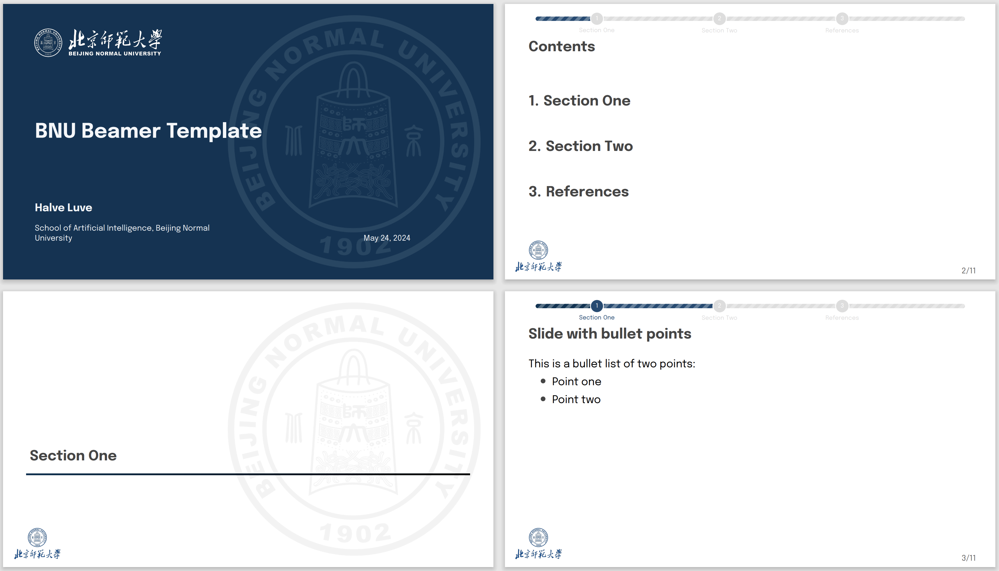

# BNU Beamer Template Based on SimplePlus Beamer Theme

> This is a **simple** and **clear** beamer theme for academic and scientific presentations. It is originally based on the Madrid beamer theme and [SimplePlus Beamer Theme](https://github.com/PM25/SimplePlus-BeamerTheme). 

This is a beamer template dedicated for BNU modified based on SimplePlus theme. The modifications include: 

- Replacement of logos (self-made, high-resolution)
- Frequently used packages added (based on personal preferences)

This is not published on Overleaf, as drawing progress bar with Tikz is highly inefficient, and certainly won't be completed with Overleaf's limited compliation time. 

For a minimal example, please refer to `eng-test.tex` , `chn-test.tex` and their corresponding `.pdf` files. Previews are shown below. 

## Quick start

Compilation of the English version has been tested on macOS 14 with TexLive 2020. Both the Chinese ang English versions only passed the tests with **XeLaTeX**. So please do check the compilation options. 

For the first time of compilation, it is recommended to <u>first comment the codes about drawing a progress bar on a general frame</u> (see lines 97-139). Otherwise the compilation is highly likely to fail. After a successful compilation without the progress bar, you are then good to uncomment the codes and re-compile to add the progress bar back, which, at least I think, can make the slides seemingly more pleasant. 

Be aware that, at line 94 in file `beamerinnerthemeSimplePlusAIC.sty`, the `\vspace` command is for aligning the contents of title page to their positions on the final page. Based on individual design of the title, it is likely that this value should be adjusted[^1]. This is certainly not elegant, will fix that later. 

You are free to add some commands in the premable part of the `.tex` files. Any adjustment is also welcome, as long as you know what you are doing. 

For any question, please feel free to contact me via Issues and [email](mailto:202011081001@mail.bnu.edu.cn).

## AIC visual identity
SimplePlus theme was adapted to use the [visual identity of AIC](https://smart-helenium-3a1.notion.site/Visual-identity-e194f93a8645492b8d00d52d759f61cc) in terms of logotypes, colors and font selections.

[^1]: Emprically, for short title (1 line), 60pt seems good to go; for a 2-line title, 38pt is recommended. 

